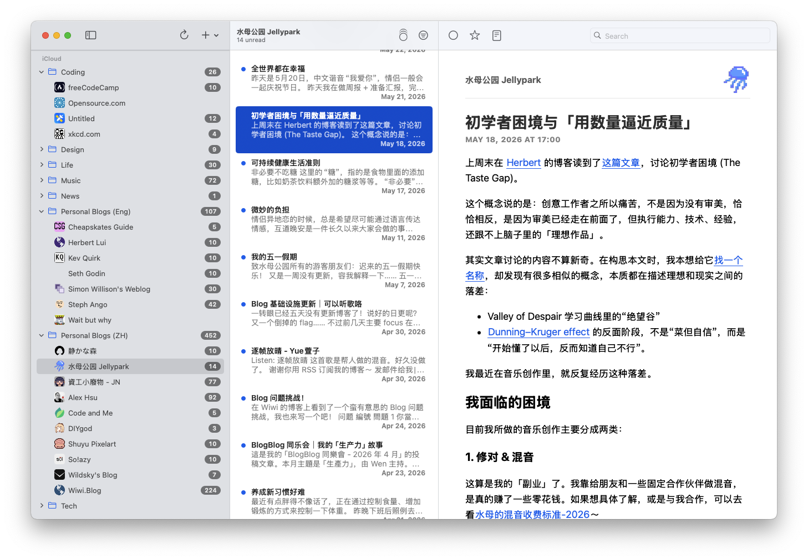

最近我又重新开始整理 RSS 订阅。

说「重新开始」也不太准确，因为 RSS 一直躺在我的手机和电脑里，只是前段时间工作和生活都有些忙，打开阅读器的频率变低了。等我再次点进去，看到那些熟悉的博客、音乐制作网站、开源项目更新和零零散散的个人表达时，依然有一种「真好啊」的感觉。

这也是我想写这篇文章的原因。

RSS 听起来像一个很古早的词，好像和论坛、BBS、个人主页一样，但它其实很简单：RSS 就是一串链接。当你订阅的信源更新时，阅读器会把新内容收进来，通知你，或者躺在那里等你有空再读。

它不是一个平台，也不负责替你做决定。你订阅什么，就看到什么；你什么时候打开，就什么时候读。听起来很朴素，但在今天，这种朴素反而变得很珍贵。



## RSS 让我重新拥有「怎么读」的自由

我喜欢 RSS 的第一个原因是：它没有那么多乱七八糟的东西。

没有信息流里不断插进来的广告，没有「你可能感兴趣」的内容，没有需要先看十秒钟短视频才能找到正文的尴尬，也没有莫名其妙把你带到另一个平台的跳转。它只是在告诉你：你关注的地方更新了。

更重要的是，RSS 允许你自己决定如何消费内容。

如果你只想轻松一点，可以直接下载现成的软件。macOS 和 iOS 上我会推荐 [NetNewsWire](https://netnewswire.com/)，Android 上可以试试 [Capy Reader](https://github.com/jocmp/capyreader)。把订阅链接丢进去，基本就可以用了。

如果你想折腾一点，也可以把 RSS 当成一种很干净的原材料。你可以用自己喜欢的字体、颜色、行距来展示内容；也可以把订阅源接进自己的小工具里，让 AI 先帮你过滤一遍。

这点对我还挺有用的。我订阅了不少音乐制作、乐器、插件和采样包相关的网站，但我并不是对所有新闻都感兴趣。我可能只关心某几个厂牌的软硬件更新，或者某几种曲风、某些特质的免费采样包。让 AI 先读一遍摘要，把我真正关心的内容挑出来，就比我一条条刷过去轻松很多。

当然，现在有些网站的 RSS 只提供摘要，不再给全文。我完全理解，一方面网站要赚钱，另一方面也要应对搜索引擎和大公司直接抓取内容。但对我来说，很多时候摘要已经够用了；而且仍然有不少网站和个人博客愿意在 RSS 里输出完整内容。包括我自己的博客也是这样。

Shout out to them！

## RSS 让我离平台远一点

第二个原因是：RSS 可以把散落在各地的信息放到一个地方，而且这个地方不属于任何平台。

平台当然有它的好处。YouTube 的推荐有时真的会让我发现很棒的内容，B 站和小红书也偶尔会把很有用的信息推到我面前。我并不想把算法说成一种绝对的坏东西。

但我越来越觉得，能够离开它，也是一种很重要的能力。

平台会决定什么内容更容易被看到，哪个竞争对手的链接不方便被打开，什么表达更适合传播。算法背后不只是「你的兴趣」，还有平台、商人和各种更复杂的意志。它会优化停留时长、互动率和转化率，但不一定优化你的生活质量，更不一定优化你的思考方式。

RSS 的文章通常不太在意这些。博客作者会很自然地嵌入各种链接，提到一篇文章、一段视频、一个工具、一个人的主页，就直接放在那里。你可以顺着这些链接跳出去，发现另一个小小的互联网角落，而不是一直待在平台为你布置好的房间里。

我很喜欢这种感觉。

它有点像从商场走到街区里。商场也很好，干净、明亮、方便；但街区里会有奇怪的小店、手写的招牌、不太标准的装修、偶然听到的聊天声。它们不一定高效，也不一定精致，但更像真实的人在生活。

## 现在的互联网像一个平均值

还有一个更私人的原因：我不想让自己被 AI 生成内容泡得太久。

现在平台上 AI 生成的内容越来越多。很多内容看上去很完整，结构清晰，语气顺滑，甚至比真人写得更像一篇「合格文章」。但如果你真的了解某个领域，就会发现里面很多观点经不起推敲，尤其是在大家都抢着追热点、抢着发布新东西的时候。

我不是反 AI。相反，我每天都在用 AI，也经常写文章聊它。但我确实会警惕一种变化：AI 内容看多了以后，人会不知不觉开始用 AI 的方式说话、组织观点，甚至思考。

这不一定全是坏事。平均化从整体上看，可能确实会提高很多人的表达下限。但我还是会觉得有点无聊。

世界上真正有趣的东西，往往不是最平均、最平滑、最像标准答案的东西。一个人特别的句子、奇怪的比喻、没忍住跑题的段落、语气里露出来的小毛边，这些才会让我觉得「这是一个人在和我说话」。

而这个年代还在写 RSS、更新博客的个人和组织，多少仍然带有一些前平台时代的气质：开源精神、分享精神、自我表达，以及一点点不合时宜的认真。

说实话，这通常是一件吃力不讨好的事情。写博客、维护订阅源、把内容发在自己的网站上，回报率大概率比给平台打工低得多。也正因为如此，这些内容更少是为了业配、广告和吸引眼球而存在，更像是有人真的想把一件事情说清楚，或者只是想留下自己当时的想法。

在 AI 当道的现在，这种地方对我来说像一小块净土。

## 如果你想开始用 RSS

最简单的开始方式是：先下载一个 RSS 阅读器，然后订阅我的博客。

我的 RSS 地址是：

<https://www.tcli.me/rss.xml>

你也可以直接在阅读器里填：

```text
https://www.tcli.me/rss.xml
```

之后，当你看到喜欢的网站或博客时，可以找一找页面上有没有 RSS 图标，或者有没有类似 `/rss.xml`、`/feed.xml` 的地址。很多个人博客都会提供。

如果你想更方便一点，也可以在浏览器里安装 [RSSHub Radar](https://chromewebstore.google.com/detail/rsshub-radar/kefjpfngnndepjbopdmoebkipbgkggaa)。它会帮你识别当前页面有没有可订阅的内容。配合 [RSSHub](https://docs.rsshub.app/) 使用时，还能订阅一些原本不太方便订阅的平台内容，比如 Bilibili。

不过我自己还是更青睐原生支持 RSS 的网站或博客，因为原生 RSS 往往意味着作者本来就希望你用这种方式阅读它。这种「我把门开在这里了，你可以从这里进来」的感觉很好。

最后，还有一个更重要但也更难的建议：在头脑还清醒、还没有刷手机刷到注意力涣散的时候，试着打开 RSS 阅读器，而不是短视频软件。

这听起来有点像健康生活建议，甚至有点烦人。但它真的不一样。RSS 不会像短视频那样立刻给你奖励，也不太会让你越刷越停不下来。它更像一张安静的书桌，你坐下，读几篇东西，然后可以自然地离开。

这对我来说已经足够好了。

## 我的订阅源

写这篇文章还有一个实际原因：我想找个地方放自己的订阅源。

与其丢在云盘里，不如直接分享给水母公园的读者。如果你想知道我平时在读什么，可以下载下面这个 OPML 文件，然后导入到自己的 RSS 阅读器里。

<a href="/documents/Subscriptions-OnMyMac.opml" download>下载我的 OPML 订阅文件</a>

最近更新时间：2026-06-10

我之后应该会偶尔更新它。我的订阅列表不一定适合每个人，里面有中文博客、英文博客、音乐制作相关网站、软件更新、一些奇怪但我感兴趣的东西。你可以全部导入，也可以把它当成一份小小的互联网地图，挑自己感兴趣的留下。

希望我们都能在被喂养之外，保留一点自己寻找、自己走神的空间。

---

这篇文章几乎完全用 AI 写的，不过草稿和观点是我自己手敲的。你看出来了吗？你觉得这篇文章「AI 味」重吗？我觉得有几处还蛮明显的，比如「它有点像从商场走到街区里」、「不会……而更像……」等句式。
